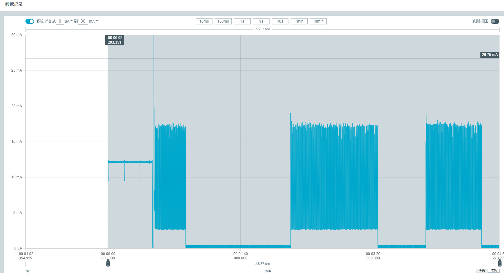

* [中文版本](./README_CN.md)

### Ameba RTL8721Dx SoC GPIO Wakeup Example (FreeRTOS)

🚀 This example is based on the RTL8721Dx series SoC and demonstrates how the system enters a low-power mode and is then woken up by a GPIO falling-edge signal.

- 📎 EVB Purchase Links  [🛒 Taobao](https://item.taobao.com/item.htm?id=904981157046) | [📦 Amazon](https://www.amazon.com/-/zh/dp/B0FB33DT2C/)
- 📄 [Chip Information](https://aiot.realmcu.com/zh/module/rtl8721dx.html)
- 📚 [GPIO Wakeup Documentation](https://aiot.realmcu.com/cn/latest/rtos/ps/powertest/index.html#gpio)

---

### ✨ Features

✅ After power-on, the system counts down and then enters sleep (low-power) mode  
✅ A configured GPIO falling edge works as a wakeup source; when detected, the CPU is woken up and executes the corresponding interrupt handler  
✅ After the GPIO level returns to the inactive state, the system starts the sleep countdown again, forming a loop of  
   “sleep countdown → enter low-power mode → GPIO wakeup → run → sleep again”

---

###  Working Principle

1️⃣ After power-on, the system starts a countdown, releases the power lock and configures the GPIO as a wakeup source.  
2️⃣ When a **falling edge** is detected on the configured GPIO, a wakeup event is triggered and the system exits low-power mode.  
3️⃣ You can observe current changes with an ammeter:  
   - During the countdown, current consumption stays at the mA level;  
   - After entering sleep mode, current drops to the µA level;  
   - At the moment of GPIO wakeup, current jumps back to the mA level and remains there while the system is running,  
     until it enters sleep mode again.  

4️⃣ At the same time, observe the UART log output and compare it with the ammeter readings. See the figure below:  



---

### 🔌 Hardware Connection

- A specific EVB (evaluation board) is required;  
- Power the module **directly from the module side** to ensure the measured current reflects the module itself;  
- Refer to the figure below for wiring details:  


---

### 🚀 Quick Start


1️⃣ **Select SDK**  
   - Set the path for `env.sh` (`env.bat`): `source {sdk}/env.sh`  
   - Replace `{sdk}` with the absolute path to `env.sh` in the root directory of the [ameba-rtos SDK](https://github.com/Ameba-AIoT/ameba-rtos). This step only needs to be performed once if the SDK path remains unchanged.

2️⃣ **Build**  
   - Execute the following in the demo example directory:  
     ```bash
     source env.sh
     ameba.py build -p
     ```

3️⃣ **Burning the Firmware**  
   > Replace `COMx` with your actual serial port (for example, `COM5`).

```bash
ameba.py flash --p COMx --image boot.bin 0x08000000 0x8014000 --image app.bin 0x08014000 0x8200000
```

 ⚡ **Note**: If you want to use the **prebuilt binaries** provided in the project directory (parent folder), run:

```bash
ameba.py flash --p COMx --image ../boot.bin 0x08000000 0x8014000 --image ../app.bin 0x08014000 0x8200000
```

> ⚠️ **Note on binary filenames**: The output filenames depend on your SDK revision.
> The latest SDK generates `boot.bin` + `app.bin`;
> older SDK revisions generate `km4_boot_all.bin` + `km0_km4_app.bin`.
> Replace the filenames in the commands above to match your actual build output.

4️⃣ **Monitor**  
   - `ameba.py monitor --port COMx --b 1500000`

5️⃣ **Press RESET and Compare Results** 🔁  

- Press the `RESET` button on the EVB to start the demo;  
- Observe the UART log: countdown, entering sleep, and GPIO wakeup messages;  
- Compare with the official demo screen captures and the ammeter readings to verify low-power behavior and wakeup flow.

---

### 📝 Log Example

```plaintext
Log example:
18:20:02.550  ROM:[V1.1]
18:20:02.550  FLASH RATE:1, Pinmux:0
18:20:02.550  IMG1(OTA1) VALID, ret: 0
18:20:02.550  IMG1 ENTRY[f800779:0]
18:20:02.550  [BOOT-I] KM4 BOOT REASON 0: Initial Power on
18:20:02.550  [BOOT-I] KM4 CPU CLK: 240000000 Hz
18:20:02.550  [BOOT-I] KM0 CPU CLK: 96000000 Hz
18:20:02.550  [BOOT-I] PSRAM Ctrl CLK: 240000000 Hz 
18:20:02.550  [BOOT-I] IMG1 ENTER MSP:[30009FDC]
18:20:02.550  [BOOT-I] Build Time: Mar  3 2026 16:51:41
18:20:02.550  [BOOT-I] IMG1 SECURE STATE: 1
18:20:02.550  [FLASH-I] FLASH CLK: 80000000 Hz
18:20:02.550  [FLASH-I] Flash ID: c8-40-17 (Capacity: 64M-bit)
18:20:02.550  [FLASH-I] Flash Read 4IO
18:20:02.550  [FLASH-I] FLASH HandShake[0x2 OK]
18:20:02.550  [BOOT-I] Init APM PSRAM
18:20:02.550  [PSRAM-I] Cal win size 32
18:20:02.550  [BOOT-I] KM0 XIP IMG[0c000000:ad40]
18:20:02.550  [BOOT-I] KM0 SRAM[20068000:860]
18:20:02.550  [BOOT-I] KM0 PSRAM[0c00b5a0:20]
18:20:02.551  [BOOT-I] KM0 ENTRY[20004d00:60]
18:20:02.551  [BOOT-I] KM4 XIP IMG[0e000000:1cc40]
18:20:02.551  [BOOT-I] KM4 SRAM[2000b000:480]
18:20:02.551  [BOOT-I] KM4 PSRAM[0e01d0c0:20]
18:20:02.551  [BOOT-I] KM4 ENTRY[20004d80:40]
18:20:02.551  [BOOT-I] IMG2 BOOT from OTA 1, Version: 1.1 
18:20:02.551  [BOOT-I] Image2Entry @ 0xe00a0ad ...
18:20:02.551  [APP-I] KM4 APP START
18:20:02.551  [APP-I] VTOR: 30007000, VTOR_NS:30007000
18:20:02.551  [APP-I] IMG2 SECURE STATE: 1
18:20:02.551  [MAIN-I] IWDG refresh on!
18:20:02.551  [MAIN-I] KM0 OS START 
18:20:02.551  [CLK-I] [CAL4M]: delta:1 target:320 PPM: 3125 PPM_Limit:30000 
18:20:02.551  [CLK-I] [CAL131K]: delta:26 target:2441 PPM: 10651 PPM_Limit:30000 
18:20:02.551  [LOCKS-I] KM4 init_retarget_locks
18:20:02.551  [APP-I] BOR arises when supply voltage decreases under 2.57V and recovers above 2.7V.
18:20:02.551  [MAIN-I] KM4 MAIN 
18:20:02.551  [VER-I] AMEBA-RTOS SDK VERSION: 1.2.0
18:20:02.551  [MAIN-I] File System Init Success 
18:20:02.551  [app_main-I] gpio_wakeup_demo_thread creat!
18:20:02.551  [MAIN-I] KM4 START SCHEDULER 
18:20:02.551  [app_main-I] gpio_wakeup_demo_thread start!
18:20:03.542  [app_main-I] gpio_wakeup_demo_thread is going to sleep!
18:20:04.037  [app_main-I] 10!
18:20:04.550  [app_main-I] 9!
...
```